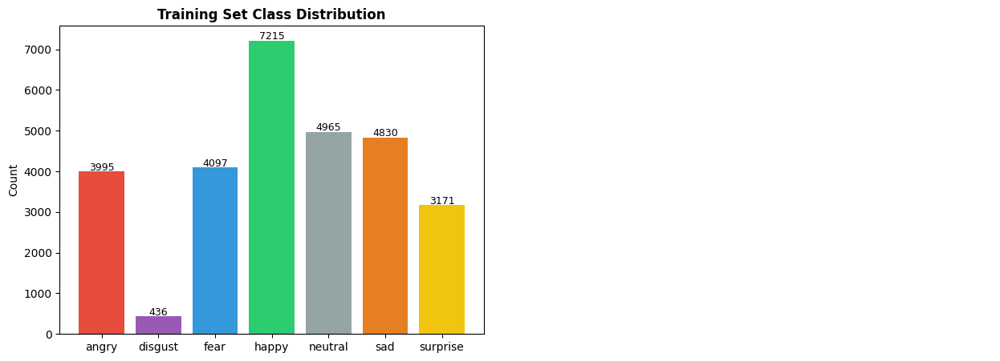
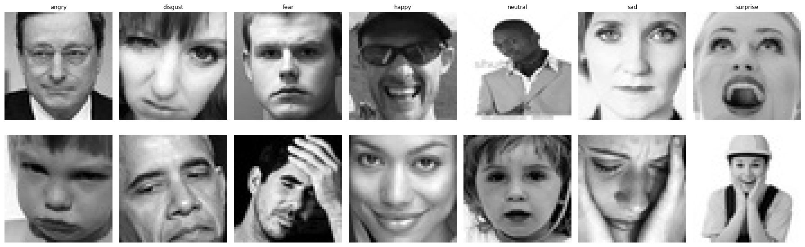
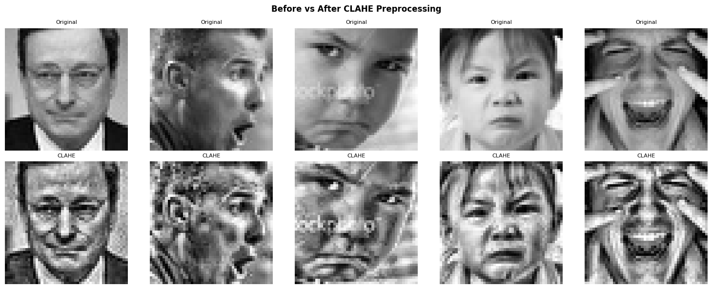
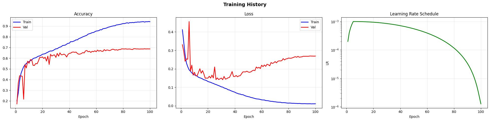
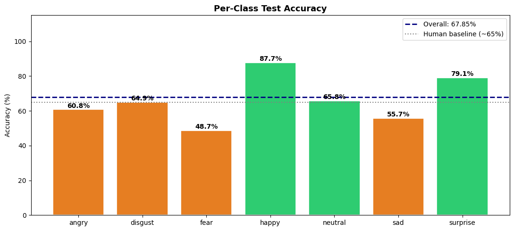
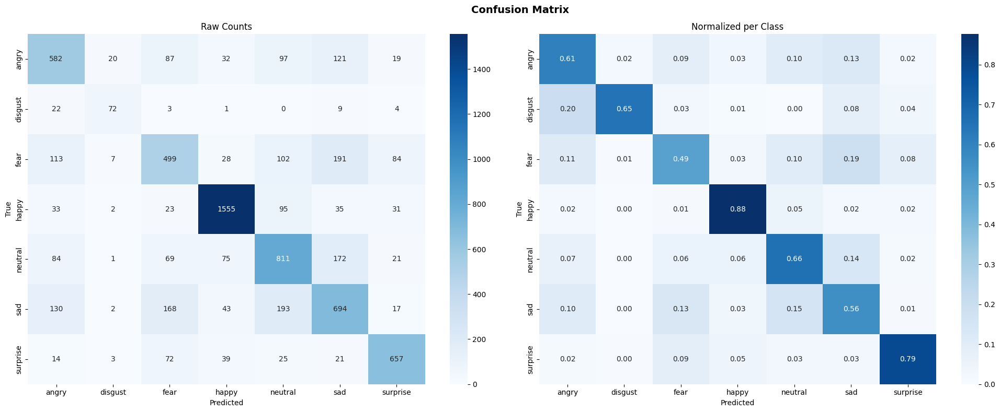
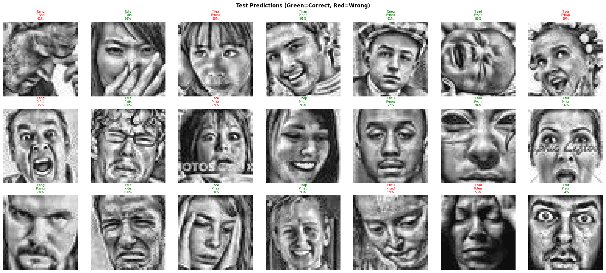

# 🎭 Facial Emotion Recognition — FER-2013

A deep **residual CNN** that classifies 48×48 grayscale face images into **7 emotions**: Angry, Disgust, Fear, Happy, Sad, Surprise and Neutral.

**Test accuracy: 67.85%**, above the roughly 65% human agreement reported on FER-2013.

**Stack:** TensorFlow / Keras · OpenCV · NumPy · scikit-learn · Matplotlib / Seaborn · Google Colab (T4 GPU)

---

## 📂 Dataset

**[FER-2013 (Kaggle)](https://www.kaggle.com/datasets/msambare/fer2013)**: 35,887 grayscale face images (48×48), organised in `train/` and `test/` folders by emotion.

| Split | Images |
|-------|--------|
| Train | 24,402 |
| Validation (15% stratified from train) | 4,307 |
| Test | 7,178 |



The dataset is **heavily imbalanced**. *Happy* has about 7,200 training images, while *Disgust* has only about 440.



> The dataset isn't included in this repo. The notebook downloads it automatically with the Kaggle API.

---

## 🔄 Pipeline

### Phase 1: Preprocessing
- **CLAHE** (Contrast Limited Adaptive Histogram Equalization) evens out the very different lighting across images.
- **Normalisation:** pixels are scaled from 0–255 to 0–1.
- **Stratified train/validation split** (85/15), keeping the official test set untouched.
- **Class weights** (`balanced`) counter the imbalance. *Disgust* gets a weight of about 9.4.
- **Data augmentation** (GPU-side `tf.data`): random horizontal flip, brightness, contrast, and pad-and-random-crop (a zoom/shift effect).



### Phase 2: Model Architecture (ResNet-style CNN)

```
Input 48×48×1
 → Conv 64 + BN + ReLU                     (stem)
 → 2× Residual Block (64)  → MaxPool → Dropout 0.2    48→24
 → 2× Residual Block (128) → MaxPool → Dropout 0.2    24→12
 → 2× Residual Block (256) → MaxPool → Dropout 0.25   12→6
 → 1× Residual Block (512) → GlobalAvgPool → Dropout 0.4
 → Dense 256 + BN + ReLU → Dropout 0.5
 → Dense 7 (softmax)
```
**6.59M parameters** in total. Every residual block has 2 Conv layers with **Batch Normalization**, plus a skip connection.

| Design choice | Why |
|---------------|-----|
| **Residual blocks** | Skip connections let gradients flow in a deep network and prevent vanishing gradients |
| **Global Average Pooling** | 512 features instead of 18,432 from Flatten, which means far less overfitting |
| **Focal Loss** (γ=2, α=0.25) | Down-weights easy examples so training focuses on hard, confusable faces |
| **AdamW** (weight decay 1e-4) | Adam with decoupled weight decay for better regularisation |
| **Cosine annealing + 5-epoch warmup** | Stable start, then smooth learning-rate decay for fine convergence |
| **EarlyStopping + ModelCheckpoint** | Keeps the best validation-accuracy weights (epoch 88) |

### Phase 3: Training & Evaluation



---

## 📊 Results

| Metric | Value |
|--------|-------|
| **Test accuracy** | **67.85%** |
| Best validation accuracy | 68.91% (epoch 88) |
| Macro F1 | 0.66 |
| Weighted F1 | 0.68 |
| Human baseline on FER-2013 | ~65% |

| Emotion | Precision | Recall | F1 | Test samples |
|---------|-----------|--------|----|--------------|
| 😄 Happy | 0.88 | 0.88 | **0.88** | 1,774 |
| 😮 Surprise | 0.79 | 0.79 | **0.79** | 831 |
| 🤢 Disgust | 0.67 | 0.65 | 0.66 | 111 |
| 😐 Neutral | 0.61 | 0.66 | 0.63 | 1,233 |
| 😠 Angry | 0.60 | 0.61 | 0.60 | 958 |
| 😢 Sad | 0.56 | 0.56 | 0.56 | 1,247 |
| 😨 Fear | 0.54 | 0.49 | **0.51** | 1,024 |



### Confusion Matrix



**Most frequent confusions** (share of each true class):

| True → Predicted | Rate | Likely reason |
|------------------|------|---------------|
| Disgust → Angry | 20% | Both involve a furrowed brow and wrinkled nose; Disgust has very few samples |
| Fear → Sad | 19% | Raised inner brows and a tense mouth appear in both |
| Sad → Neutral | 15% | Low-intensity sadness looks almost neutral |
| Neutral → Sad | 14% | The same overlap in the other direction |
| Angry → Sad | 13% | Downturned mouth and lowered brows |
| Sad → Fear | 13% | The same brow pattern as Fear → Sad |

**Sad, Fear and Neutral form a cluster** of mutual confusion. *Happy* and *Surprise* are the easiest, because their expressions are distinctive: a smile, and wide eyes with an open mouth.

### Sample Predictions


---

## 💡 Key Findings

1. **Class weights rescued Disgust.** Even with only 111 test images, it reached an F1 of 0.66, close to the middle classes.
2. **Fear is the hardest emotion** (49% recall). It's spread across Sad, Angry, Neutral and Surprise.
3. **The model reaches human-level performance.** FER-2013 labels are noisy, since human annotators agree only about 65% of the time, which caps any model's achievable accuracy.
4. **There is an overfitting gap.** Training accuracy reached about 94% while validation stayed around 69%, even with dropout, augmentation and weight decay.

---

## ⚠️ Limitations & Future Work

- **Overfitting:** Stronger augmentation (random **rotation** and zoom, mixup or cutmix) or label smoothing could close the train/validation gap.
- **Transfer learning:** Fine-tuning a pretrained backbone (e.g. ResNet-50, EfficientNet) on upscaled faces usually reaches 70%+ accuracy.
- **Test-time augmentation:** Averaging predictions on flipped images is a cheap way to gain 1–2%.
- **Real-time demo:** Add OpenCV Haar-cascade face detection plus webcam inference to classify live faces.
- **Label noise:** FER+ (Microsoft's re-labelled FER-2013) provides cleaner labels.

---

## 🚀 How to Run (Google Colab)

1. Open `FER2013_Emotion_Recognition.ipynb` in Colab and select a **T4 GPU** (Runtime → Change runtime type).
2. Get your Kaggle API key: go to [kaggle.com](https://www.kaggle.com) → Settings → **Create New Token**, which downloads `kaggle.json`.
3. Run the first cell and upload `kaggle.json` when prompted. The dataset (about 60 MB) downloads automatically.
4. Run all the cells. Training takes about **70 minutes** on a T4 (up to 100 epochs at about 40 s each).

---

## 🗂️ Project Structure

```
Facial-Emotion-Recognition-FER2013/
├── FER2013_Emotion_Recognition.ipynb   # Full pipeline: data → CLAHE → ResNet → training → evaluation
├── requirements.txt
├── README.md
└── images/
    ├── class_distribution.png
    ├── sample_images.png
    ├── clahe_effect.png
    ├── training_curves.png
    ├── confusion_matrix.png
    ├── per_class_accuracy.png
    └── prediction_samples.png
```

---

## 🛠️ Tech Stack

Python · TensorFlow / Keras · OpenCV · NumPy · scikit-learn · Matplotlib · Seaborn · Kaggle API · Google Colab

---

## 👤 Author

**Basmala Farouk** — AI Engineer
